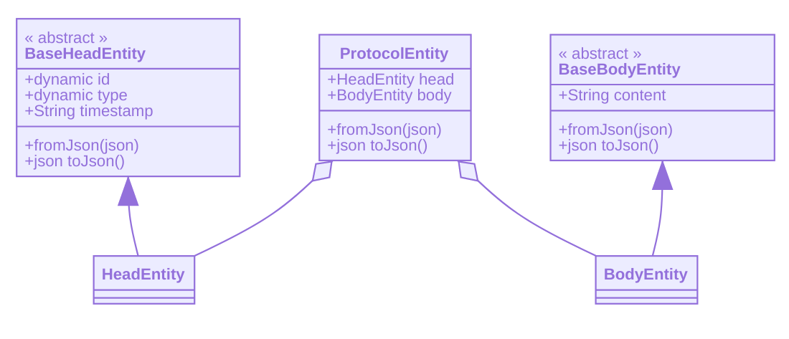
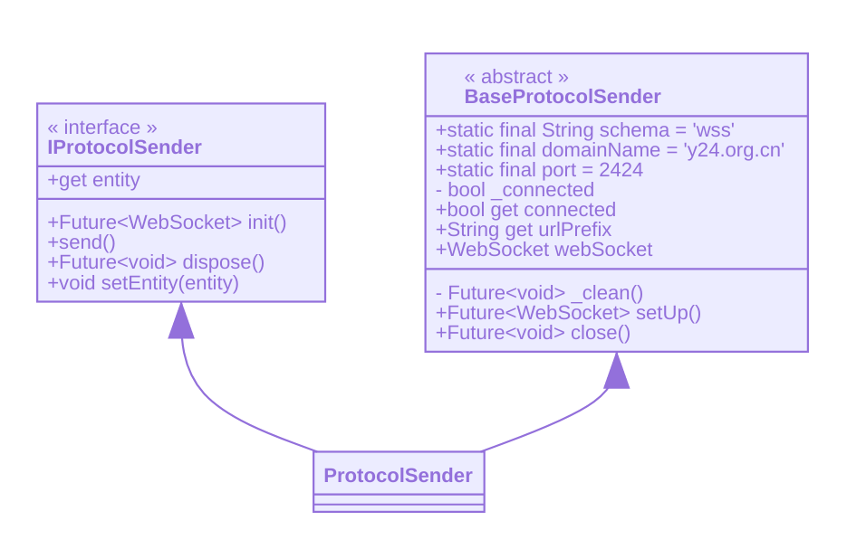
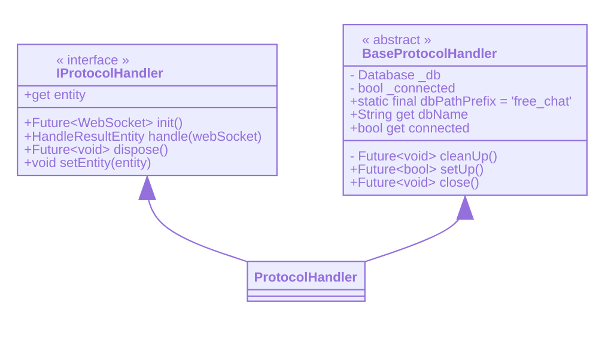
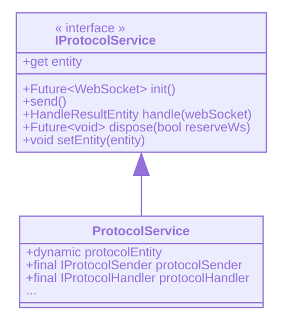
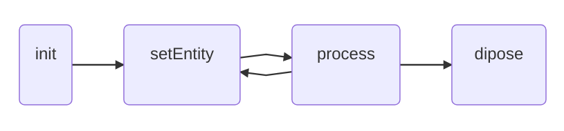

# Protocol

## Introduction

Generally speaking, `Protocol` is the bridge which does the communication work with the server just like protocol in the field of computer networks, and it's the **only** one that can do such work under my design for security consideration. For example, please consider the register module of a new user, after basic register info have been gathered, the user click the `Register` button, some communication work must be done with the server like verification, enrolment and so on, in this situation, `Protocol` is exactly the key tool for such bussiness logical. `Free Chat`, as an online chat application, has to use `Protocol` in many cases.

## Usage

Before using the existing `Protocol`,the following stuff requires understanding.
  
- entity
- sender
- handler
- service

### entity

`entity` represents the `Protocol` entity just like the same thing in the computer networks, but there are some differences. Every `entity` of the corresponding `Protocol` should have exact the following two fields and the class relationship is shown below:

- head
- body



### sender

`sender` performs as a client like the same thing in the computer networks as it does the ***request*** work. Every `sender` **must** be organized and implemented as below.



### handler

Correspondingly, `handler` performs as a server like the same thing in the computer networks as it does the ***response*** work.Every `handler` **must** be organized and implemented as below.



### service

In a word, `service` = `sender` + `handler`.
The public interface of `servie`  have both ***send*** and ***handle*** methods which makes `protocol` full-duplexed.
In other word, it's the combination of client and server, thus enable two-way communication.



OK, almost everything is ready now. Let's get start.

- If a `sender` `handler` or `service` is need, just create a corresponding new  instance, It is encouraged to use the interface to get the reference.
  ***Tips:***

  ```code
  IProtocolSender accountProtocol = AccountProtocolSender(username: 'Y24',password: '***');
  ```

- After the instance is hooked, you need to do the initial work which requiring the ***init*** method.
  ***Note:*** As this method returns a **Future** and it needs some time to complete, you may use ***then*** or ***await***. What's more, multiple initalization work is not prohibited as the later one would return directly.
  ***Tips:***
  
  ```code
  final websocket = await accountProtocol.init();
  ```

- After finishing the initialization, it's time to do the data injection work. It means that  ***setEntity*** method should be invoked.
***Note:*** this method need a argument with the corresponding type ***ProtocolEntity***.
 ***Tips*:**

  ```code
    final protocolEntity =
         AccountProtocolEntity(
                head: AccountHeadEntity(
                     code: AccountProtocolCode.register,
                    id: registerUsername,
                    timestamp: DateTime.now(),
                ),
                 body: AccountBodyEntity(
                    content: registerPassword,
                 ));
    accountProtocol.setEntity(protocolEntity);
  ```

- After data-injection, You can call the key method now: ***send*** in `sender` , ***handle*** in `handler` or the corresponding method in `service`.
***Note:*** However, this method doesn't return a **Future** as you may expect. A **Future** is unnecessary in this case and will cause some unexpected rewriten issues when callback function is invoked repeatly at the same time.
 ***Tips:***

  ```code
  final result = accountProtocol.send();
  ```

- Do the data-injection and processing loop for multiple calls.
  
- At the end, if the protocol is no long required, It should be disposed by method ***dispose***.
***Note:*** after this method has been called once, This instance of  `Protocol` should not be reused later.
***Tips:***

  ```code
  await accountProtocol.dispose();
  ```

The flow chart is shown below:

  
## Implement

The implement of `Protocol` is very easy to understand, it's just a lightweight package using some `APIs` which are `WebSocket`-related in `Dart`. Then, there is actually nothing else to be supplemented as the source code is not obscure for most people and shows everything.

## Expansion

Well, if you need to create a new `Protocol`, the follwing things **must** stay within your consideration and design blueprint.

- Entity
  You must design and implement the entity yourself and follow the standard as mentioned above.
  ***Note:*** This is the most important field for you. You may need to look up the existing `Protocols` for some references.

- Internal concrete business logical.
  For example, please consider `AccountProtocol`, perhaps your need to implement some related business loical such as ***login***, ***register***, ***cleanUp***, ***logout*** and etc.

- Unite everything well and make it work.

- Test work cannot be ignored.

***Tips:*** The existing `Protocols` can be well-formed template for you to descover.
