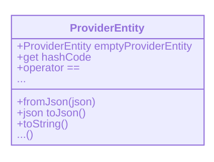
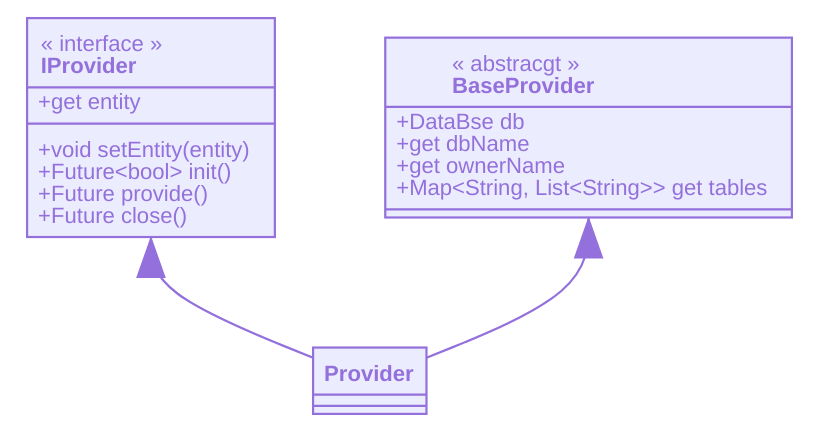

# Provider

## Introduction

Generally speaking, `Provider` is is the bridge which does the communication work with the hosted database, and it's the **only** one that can do such work under my design for security consideration. For example, please consider the following situation:
Oneday,you open the app, login  successfully, chat with someone happily, then close the app before sleeping, you may feel annoyed after you wake up, reopen the app and find that everything has gone.
The data and state maintainablitity are both implemented by `Provider`.
***Note:*** The app side uses **`SQLite`** while the server side uses **`MongoDB`**.

## Usage

Before using the existing `Provider`,the following stuff requires understanding.
  
- entity
- provider

### entity

`entity` represents the `Provider` entity, which is similar to the `M` in `MVC`. Besides, it should use `Null object pattern` and the following methods should be overrided for bussiness requirement:

- hashCode
- toString
- operator ==

Last, it should have a `Named constructor`: ***fromMap*** and a method named ***toMap*** in order to integrate with the target database.



### provider

`provider` performs the actual communication work with the target database and should be designed as follows:



OK, almost everything is ready now. Let's get start.

- If a `provider` is need, just create a corresponding new  instance, It is encouraged to use the interface to get the reference.
  ***Tips:***

  ```code
  IProvider accountProvider = AccountProvider();
  ```

- After the instance is hooked, you need to do the initial work which requiring the ***init*** method.
  ***Note:*** As this method returns a **Future** and it needs some time to complete, you may use ***then*** or ***await***. What's more, multiple initalization work is not prohibited as the later one would return directly.
  ***Tips:***
  
  ```code
  final result = await accountProvider.init();
  ```

- After finishing the initialization, it's time to do the data injection work. It means that  ***setEntity*** method should be invoked.
***Note:*** this method need a argument with the corresponding type ***ProviderEntity***.
 ***Tips*:**

  ```code
     final accountEntity = AccountEntity(
            username: 'Y24',
            password: '***",
            role: Role.user,
            loginStatus: true,
            lastLoginTimestamp: DateTime.now(),
            lastLogoutTimestamp: DateTime.now(),
          );
    accountProvider.setEntity(providerEntity);
  ```

- After data-injection, You can call the key method now: ***provider***.
***Note:*** However, this method return a **Future** as you may expect this time. so when this function is invoked repeatly at the same time,it may cause some unexpected rewriten issues.

  ```code
  final result = await accountProvider.provide();
  ```

- Do the data-injection and processing loop for multiple calls.
  
- At the end, if the provider is no long required, It should be disposed by method ***close***.
***Note:*** after this method has been called once, This instance of  `Provider` should not be reused later.
***Tips:***

  ```code
  await accountProvider.close();
  ```

The flow chart is shown below:

  
## Implement

The implement of `Provider` is very easy to understand, it's just a lightweight package using the following two packages:

- `sqflite`
- `mongoDB`
  
Then, there is actually nothing else to be supplemented as the source code is not obscure for most people and shows everything.

## Expansion

Well, if you need to create a new `Provider`, the follwing things **must** stay within your consideration and design blueprint.

- Entity
  You must design and implement the entity yourself and follow the standard as mentioned above.
  ***Note:*** This is the most important field for you. You may need to look up the existing `Providers` for some references.

- Internal concrete business logical.
  For example, please consider `AccountProvider`, perhaps your need to implement some related business loical such as ***queryLogined***, ***queryAllHistory***, ***queryHistory***, ***addHistory***, ***deleteHistory***, ***updateHistory***, ***login***, ***logout*** and etc.

- Unite everything well and make it work.

- Test work cannot be ignored.

***Tips:*** The existing `Providers` can be well-formed template for you to descover.
